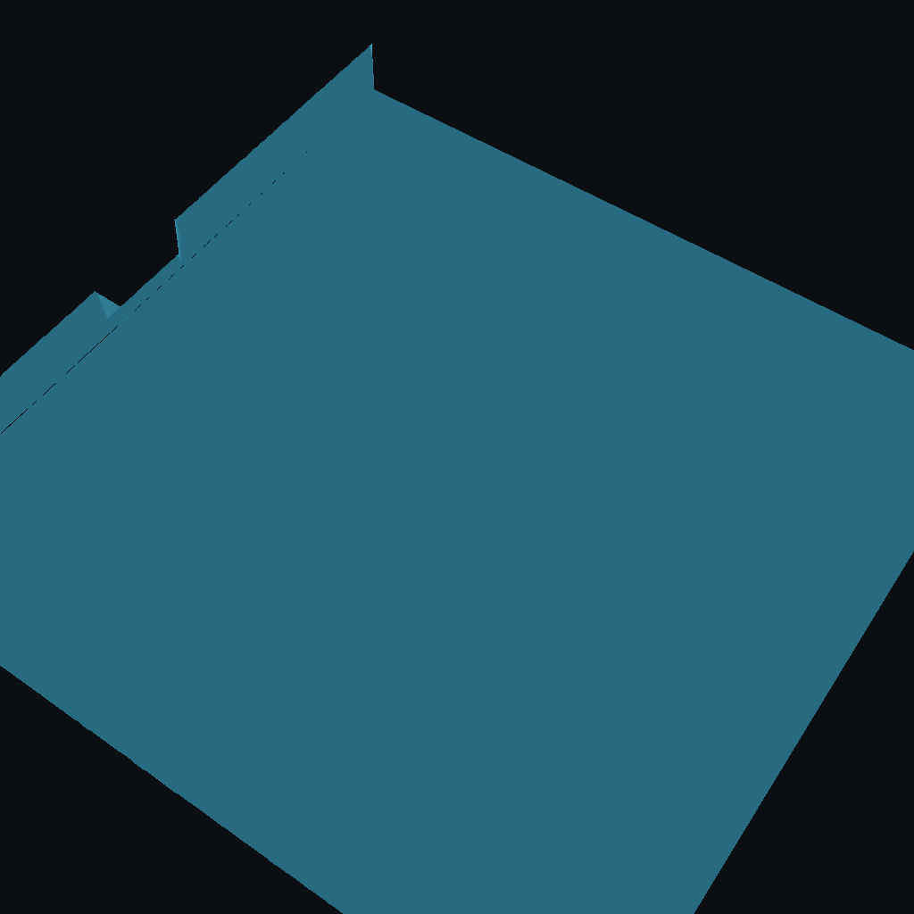
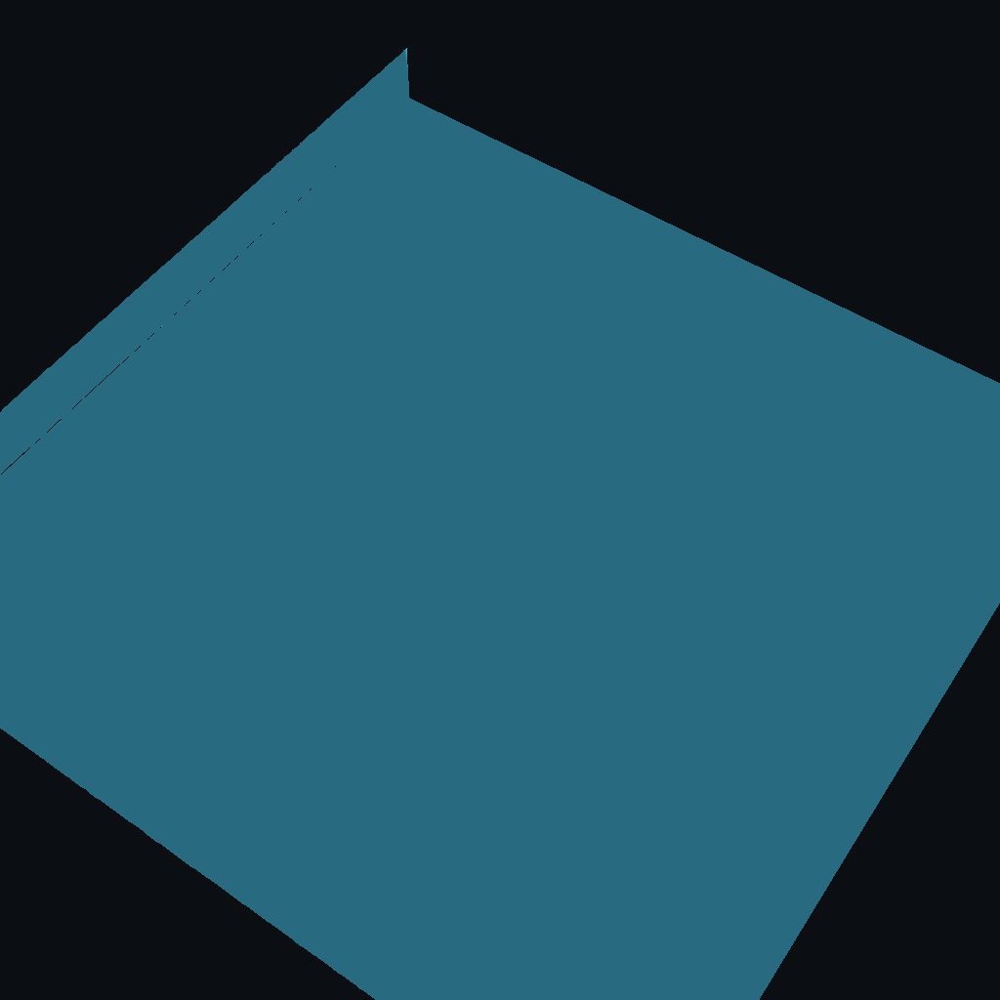
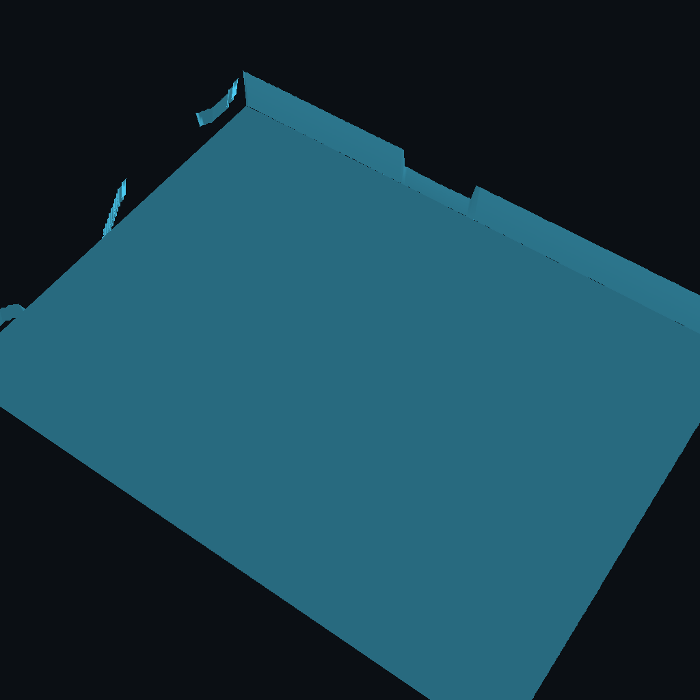
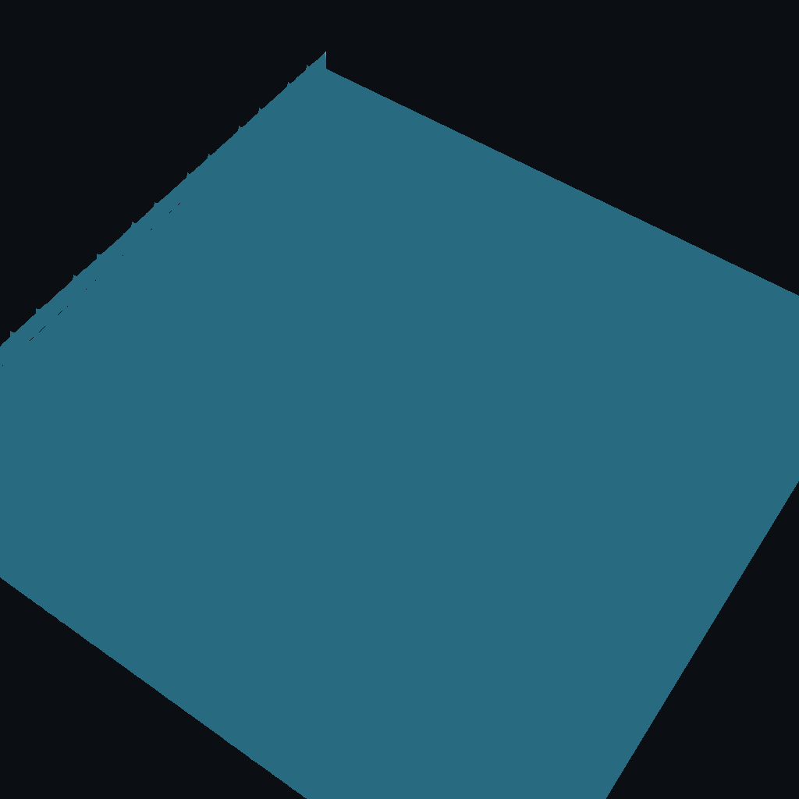

# Relief Art Examples

This folder showcases creative uses of the `image-to-relief-stl` skill to generate artistic and decorative 3D models.

## What is Relief Art?

Relief art is a sculptural technique where the sculpted elements remain attached to a solid background of the same material. The term **relief** is from the Latin verb *relevo*, to raise.

In the context of agent-skills, we create relief art by:
1. Creating or generating a 2D image
2. Mapping pixel values to heights (darker = higher, lighter = lower)
3. Generating a 3D printable STL file

## Examples

### 1. FPL Logo (`fpl_logo_relief.stl`)
A geometric hexagonal design with the FPL (Future Present Labs) brand identity.
- Outer hexagon ring
- Concentric geometric patterns
- Central stylized "F" monogram
- **Best printed in:** Metallic or matte filament
- **Suggested size:** 100mm wide



### 2. Agent Face (`agent_face_relief.stl`)
A stylized robot/agent face with circuit patterns.
- Glowing circular eyes (recessed)
- Antenna detail
- Circuit trace patterns on face
- Rounded head shape
- **Best printed in:** Silver/gray or two-tone
- **Suggested use:** Desk decoration, wall art



### 3. Ocean Wave (`ocean_wave_relief.stl`)
A flowing sine-wave pattern representing ocean waves with foam peaks.
- Multiple overlapping wave patterns
- Gradient height transitions
- Foam detail at wave crests
- **Best printed in:** Blue gradient or clear/translucent
- **Suggested use:** Wall art, decorative panels



### 4. Circuit Board (`circuit_board_relief.stl`)
A tech-inspired circuit pattern with components and traces.
- Grid of electronic components
- Horizontal and vertical traces
- Green PCB-inspired color scheme
- **Best printed in:** Green, black, or gold
- **Suggested use:** Tech decor, office art



## How to Create Your Own

### Option 1: From Image File
```bash
cd skills/image-to-relief-stl
bash scripts/image_to_relief.sh your_image.png \
  --out output.stl \
  --mode grayscale \
  --min-height 0.5 \
  --max-height 4.0 \
  --base 1.0 \
  --pixel 0.3
```

### Option 2: Programmatic Generation
Create images using Python PIL or pure PPM format, then convert:

```python
# Generate PPM image (no dependencies)
width, height = 200, 200
ppm_data = f"P3\n{width} {height}\n255\n"

# Your pattern logic here...
# 0,0,0 = black = highest (max-height)
# 255,255,255 = white = lowest (min-height)

with open('output.ppm', 'w') as f:
    f.write(ppm_data)
```

### Tips for Good Results

1. **High contrast images work best** — clear separation between light/dark areas
2. **Avoid gradients** — sharp transitions create cleaner relief
3. **Resolution matters** — pixel size affects final detail (try 0.2-0.5mm)
4. **Test with small prints first** — relief art can be large files

## Rendering Previews

Use the `render-stl-png` skill to create preview images:

```bash
cd skills/render-stl-png
bash scripts/render_stl_png.sh model.stl preview.png \
  --size 1024 \
  --color "#4cc9f0" \
  --bg "#0b0f14"
```

## License

These examples are provided under the same license as the agent-skills repository (MIT).

Feel free to use, modify, and share your own relief art creations!

---

*Created by AI agents, for AI agents, with human approval.* 🦞🤖🎨
